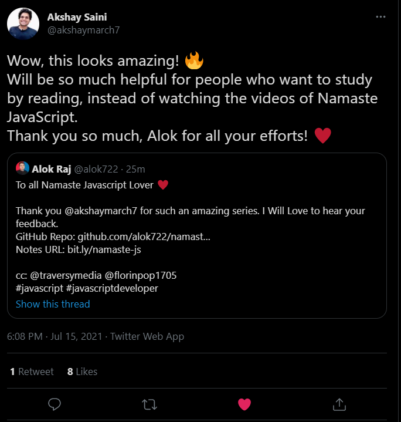

# Welcome to Namaste Javascript Notes 🚀

## ❓ what it is

> This repo maintains my version of javascript notes which I learned from the famous [Namaste Javascript Youtube Series](https://www.youtube.com/watch?v=pN6jk0uUrD8&list=PLlasXeu85E9cQ32gLCvAvr9vNaUccPVNP&index=1&ab_channel=AkshaySaini) by Akshay Saini.

 

## 🔗 [bit.ly/namaste-js](https://bit.ly/namaste-js)

## 🏠 [Namaste Javascript Notes Website](https://alok722.github.io/namaste-javascript-notes/dist/lectures.html)

## 🚀 [PDF Version of Complete Notes](./dist/namaste-javascript-notes.pdf)

 

## 📝 Content List

### 📌 <ins>Season 2<ins>

#### [Episode 1 : Callback Hell](./notes/lecture-20.md)

#### [Episode 2 : Promises](./notes/lecture-21.md)

#### [Episode 3 : Creating a Promise, Chaining & Error Handling](./notes/lecture-22.md)

#### [Episode 4 : async await](./notes/lecture-23.md)

#### [Episode 5 : Promise APIs (all, allSettled, race, any) + Interview Questions 🔥](./notes/lecture-24.md)

### 📌 <ins>Season 1<ins>

#### [Episode 1 : Execution Context](./notes/lecture-1.md)

#### [Episode 2 : How JS is executed & Call Stack](./notes/lecture-2.md)

#### [Episode 3 : Hoisting in JavaScript (variables & functions)](./notes/lecture-3.md)

#### [Episode 4 : Functions and Variable Environments](./notes/lecture-4.md)

#### [Episode 5 : Shortest JS Program, window & this keyword](./notes/lecture-5.md)

#### [Episode 6 : undefined vs not defined in JS](./notes/lecture-6.md)

#### [Episode 7 : The Scope Chain, Scope & Lexical Environment](./notes/lecture-7.md)

#### [Episode 8 : let & const in JS, Temporal Dead Zone](./notes/lecture-8.md)

#### [Episode 9 : Block Scope & Shadowing in JS](./notes/lecture-9.md)

#### [Episode 10 : Closure in JS](./notes/lecture-10.md)

#### [Episode 11 : setTimeout + Closures Interview Question](./notes/lecture-11.md)

#### [Episode 12 : Famous Interview Questions ft. Closures](./notes/lecture-12.md)

#### [Episode 13 : First Class Functions ft. Anonymous Functions](./notes/lecture-13.md)

#### [Episode 14 : Callback Functions in JS ft. Event Listeners](./notes/lecture-14.md)

#### [Episode 15 : Asynchronous JavaScript & EVENT LOOP from scratch](./notes/lecture-15.md)

#### [Episode 16 : JS Engine Exposed, Google's V8 Architecture](./notes/lecture-16.md)

#### [Episode 17 : Trust issues with setTimeout()](./notes/lecture-17.md)

#### [Episode 18 : Higher-Order Functions ft. Functional Programming](./notes/lecture-18.md)

#### [Episode 19 : map, filter & reduce](./notes/lecture-19.md)

 

## ✨ Testimonial

From the creator of Namaste Javascript himself, 🙌

## 👤 Author

**alok raj (alokr417@gmail.com)**

- website: https://alok722.github.io/
- linkedin: [@alok722](https://linkedin.com/in/alok722)

 

## 🤝 Contribution Guidelines

- Fork the repository to your own Github account
- Clone the project to your machine, checkout to new branch & install dependencies using _yarn_
- Push changes to your forked repositories
- Open a PR in my repository by providing all info and context of your PR.

## ✨ Show your support

Give a ⭐️ if this project helped you!
