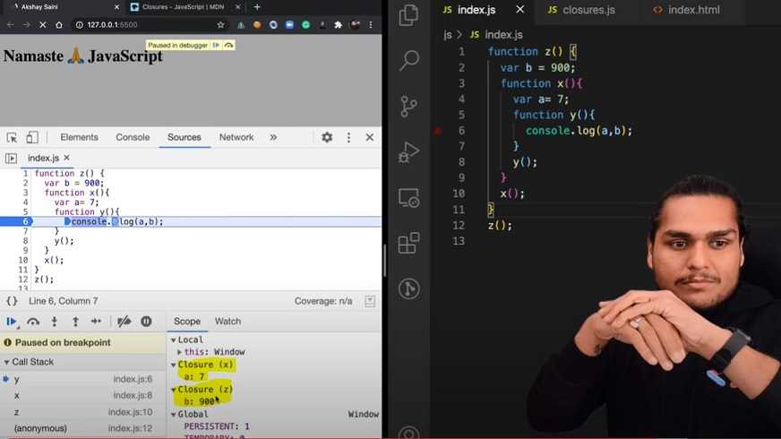

# Episode 10 : Closures  in JS

* Function bundled along with it's lexical scope is **closure**.

* JavaScript has a lexcial scope environment. If a function needs to access a variable, it first goes to its local memory. When it does not find it there, it goes to the memory of its lexical parent. See Below code, Over here function **y** along with its lexical scope i.e. (function x) would be called a closure.
    ```js
    function x() {
        var a = 7;
        function y() {
            console.log(a);
        }
        return y;
    }
    var z = x();
    console.log(z);  // value of z is entire code of function y.
    ```
    * In above code, When y is returned, not only is the function returned but the entire closure (fun y + its lexical scope) is returned and put inside z. So when z is used somewhere else in program, it still remembers var a inside x()

* Another Example
```js
    function z() {
        var b = 900;
        function x() {
            var a=7;
            function y(){
                console.log(a,b);
            }
            y();
        }
        x();
    }
    z();    // 7 900
```

* Thus In simple words, we can say:
    * ***A closure is a function** that has access to its outer function scope even after the function has returned. Meaning, A closure can remember and access variables and arguments reference of its outer function even after the function has returned.*


<br>

* 

* Advantages of Closure:
  * Module Design Pattern
  * Currying
  * Memoize
  * Data hiding and encapsulation
  * setTimeouts etc.

* Disadvantages of Closure:
  * Over consumption of memory
  * Memory Leak
  * Freeze browser


<hr>

Watch Live On Youtube below:

<a href="https://www.youtube.com/watch?v=qikxEIxsXco&ab_channel=AkshaySaini" target="_blank"></a>
